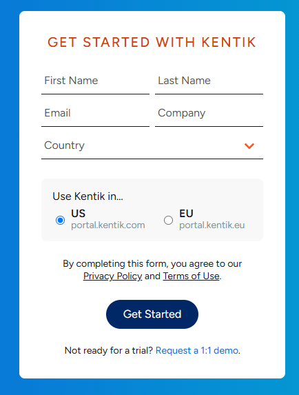
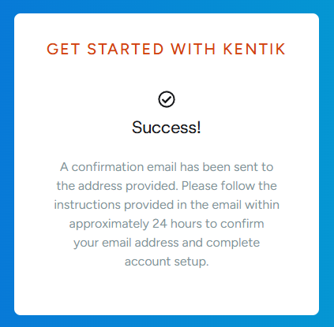
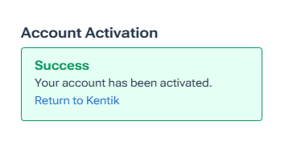
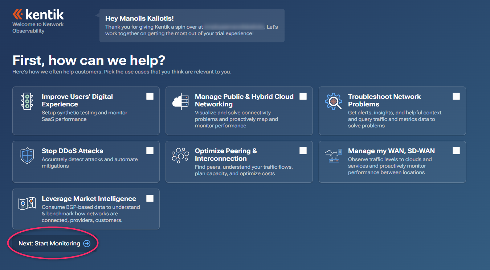
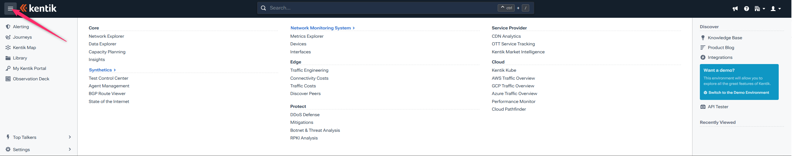
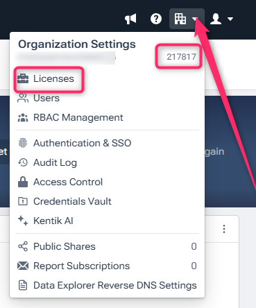
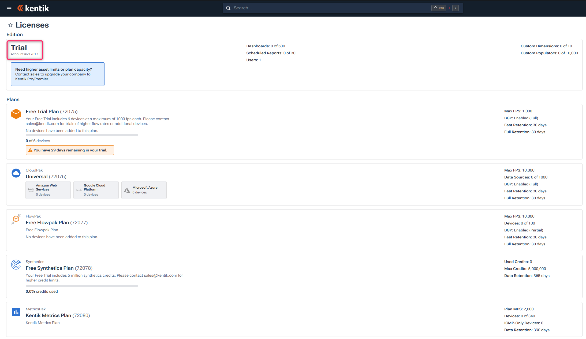

+++
title = "Pre-Lab Tasks"
linkTitle = 'Lab Prereqs'
type = "home"
weight = 1
+++
---
Prior to this workshop, you should have received an email with instructions on how to set up a free trial Kentik account. This is a prerequisite step in order to be able to run the Labs during the workshop.

If you already have registered for an account you can follow the tasks for validation.

### Task 0.1 - Register for a Free Trial Account

Navigate to [kentik.com/get-started](https://www.kentik.com/get-started/) and fill in your details in the form to create your free trial Kentik account.

> [!WARNING]
> Use your **personal** email and stick to the **US** portal. For the company field, you could specify something like `partnerwks_<nickname>`. 

Once you submit the form, check your inbox for an account activation email and follow the link in order to set your password and activate your account.

Click the `Return to Kentik` link or navigate to [portal.kentik.com](https://portal.kentik.com) and log in using your credentials.

---
### Task 0.2 - Access the portal and check out the platform

Once logged in for the first time, you can click the `Next: Start Monitoring` button to get access to the portal.

Click on the hamburger icon on the top right corner to expose the Menu.

Here you can access the different products and workflows available in the platform.

Click on the Building icon on the top right corner to expose your **Organization Settings** and note your **Account ID** number assigned.

Click the `Licenses` link to get to your licensing page.

> [!TIP]
> If you are redirected to the Onboarding Wizard page, just do a logout/login and visit your license page once more

Here you can see the Free Licenses and their limits you can use in the respective products in the platform.

---

# **Thanks for Activating your trial account**