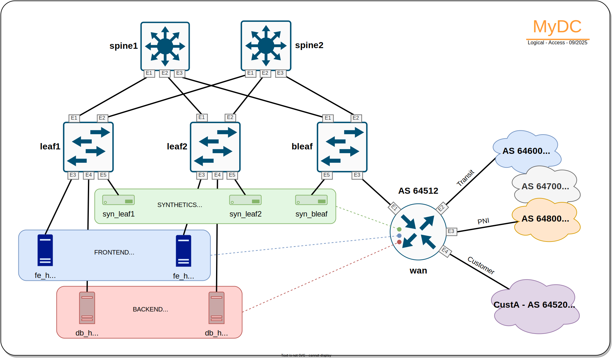

+++
title = "Topology"
linkTitle = 'Topology'
type = "home"
weight = 2
+++
---

This section will familiarize you with the network topology that we are going to be using throughout this workshop.

While go through the topology, please, access the [LAB link]() and start LAB.1 that will take about 5 minutes to load and set things up for us.

